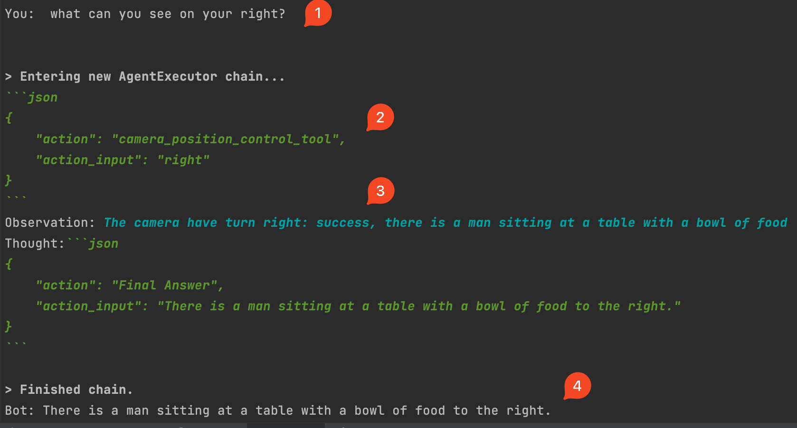

# Wall-E Robot
Build the Wall-E Robot with the cutting edge AI tools.

And you can talk with Robot, like "What can you see on your right?", and then it turn right, and speak out what she can see.

## Dependencies/Features
- OpenAI
- Cohere AI
- Langchain
- Edge-TTS
- Vision Capture(Salesforce BLIP)
  - Idea from: https://github.com/xISSAx/Alpha-Co-Vision
  - Optimized: https://github.com/pjq/Alpha-Co-Vision 
- Google Search
- Weather
- Wolfram
- Whisper

And generally speaking, it can integrate all the tools build by Langchain.

## Setup the environment

### Clone Code
```shell
git clone git@github.com:pjq/wall-e-robot.git 
pip install -r requirements.txt
```

### Update config.json
```json
{
  "cohere_api_key": "",
  "openai_api_key": "",
  "enable_openai": true,
  "openai_api_base_url": "",
  "enable_mps": true,
  "blip_model": "Salesforce/blip-image-captioning-base",
  "whisper_cpp_path":"",
  "edge_tts_enable": true,
  "car_api_url": "",
  "edge_tts_voice": "en-US-JennyNeural",
}
```

## How to start
```shell
python wall-e.py --config myconfig.json
```

## Demo

### Watch the video
<a href="http://www.youtube.com/watch?feature=player_embedded&v=g8Y3NKmDN_c" target="_blank">
 
</a>


### Wall-E Robot Console



## Car API Service
Several years ago, I build the smart car with Raspberry Pi
- https://github.com/pjq/rpi
- 
And it supports call the Restful API to control the car which can be used by the LLM.
- http://host:8092/api/swagger-ui.html

And basically, it need to support the following params. 
```python
class CarAction:
    SUPPORTED_ACTIONS = ("stop", "left", "right", "up", "down")

    def __init__(self):
        self.action = ""
        self.duration = 0
        self.speed = 0
        self.angle = 0
```

## Reference
- https://github.com/pjq/rpi
- https://github.com/xISSAx/Alpha-Co-Vision
- https://github.com/pjq/Alpha-Co-Vision

## Toubleshooting
```shell
ImportError: cannot import name 'BlipProcessor' from 'transformers' (/Users/i329817/miniconda3/lib/python3.10/site-packages/transformers/__init__.py)
```
You can install it
```shell
pip install git+https://github.com/huggingface/transformers
```

## Python environment
```shell
 conda create --name wall-e python=3.10 
 conda activate wall-e
 pip install -r requirements.txt
 conda deactivate wall-e
```
